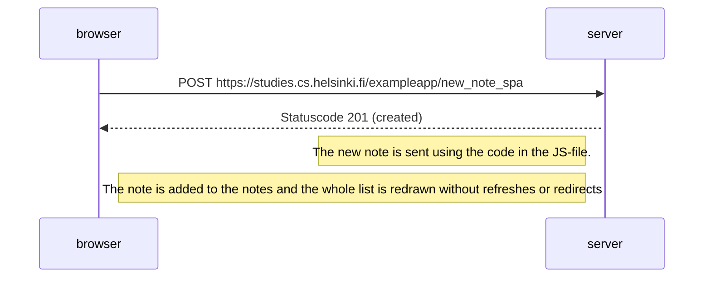

```mermaid
sequenceDiagram
  participant browser
  participant server

  browser->>server: POST https://studies.cs.helsinki.fi/exampleapp/new_note_spa
  activate server
  server-->>browser: Statuscode 201 (created)

  Note left of server: The new note is sent using the code in the JS-file.
  Note left of server: The note is added to the notes and the whole list is redrawn without refreshes or redirects
```
